# Markmap MCP Server



[](https://www.npmjs.com/package/@jiushan93/markmap-mcp-server)
[](LICENSE)
[](README_zh-CN.md)
[](https://github.com/jiushan-test/markmap-mcp)

Markmap MCP Server is based on the [Model Context Protocol (MCP)](https://modelcontextprotocol.io/introduction) that allows one-click conversion of Markdown text to interactive mind maps, built on the open source project [markmap](https://github.com/markmap/markmap). The generated mind maps support rich interactive operations and can be exported in various image formats.

> 🎉 **Explore More Mind Mapping Tools**
>
> Try [MarkXMind](https://github.com/jinzcdev/markxmind) - An online editor that creates complex mind maps using simple XMindMark syntax. It supports real-time preview, multi-format export (.xmind/.svg/.png), importing existing XMind files. [Try it now](https://markxmind.js.org/)!

## Features

- 🤖 **AI-Powered Generation**: Generate mind maps from plain text using Alibaba Cloud Qwen AI (NEW in v0.2.0)
- 🌠 **Markdown to Mind Map**: Convert Markdown text to interactive mind maps
- 🔗 **URL Download Support**: Download Markdown files directly from URLs for conversion
- ☁️ **Aliyun OSS Integration**: Automatically upload generated mind maps to Aliyun Object Storage and get online access links
- 🖼️ **Multi-format Export**: Support for exporting as PNG, JPG, and SVG images
- 🔄 **Interactive Operations**: Support for zooming, expanding/collapsing nodes, and other interactive features
- 📋 **Markdown Copy**: One-click copy of the original Markdown content
- 🧹 **Auto Cleanup**: Automatically delete local temporary files after OSS upload

## Prerequisites

1. Node.js (v20 or above)

## Installation

### Manual Installation

```bash
# Install from npm
npm install @jiushan93/markmap-mcp-server -g

# Basic run
npx -y @jiushan93/markmap-mcp-server

# Specify output directory
npx -y @jiushan93/markmap-mcp-server --output /path/to/output/directory
```

Alternatively, you can clone the repository and run locally:

```bash
# Clone the repository
git clone https://github.com/jiushan-test/markmap-mcp.git

# Navigate to the project directory
cd markmap-mcp

# Build project
npm install && npm run build

# Run the server
node build/index.js
```

## Usage

### Configuration (AI and OSS Required)

**⚠️ Important: This tool requires both Qwen AI API and Aliyun OSS configuration to work.**

Add the following configuration to your MCP client configuration file:

```json
{
  "mcpServers": {
    "markmap": {
      "type": "stdio",
      "command": "npx",
      "args": ["-y", "@jiushan93/markmap-mcp-server"],
      "env": {
        "QWEN_API_KEY": "sk-your-dashscope-api-key",
        "OSS_ACCESS_KEY_ID": "your-oss-access-key-id",
        "OSS_ACCESS_KEY_SECRET": "your-oss-access-key-secret",
        "OSS_BUCKET": "your-oss-bucket-name",
        "OSS_REGION": "oss-cn-beijing",
        "OSS_ENDPOINT": "oss-cn-beijing.aliyuncs.com",
        "MARKMAP_DIR": "/path/to/output/directory"
      }
    }
  }
}
```

> [!IMPORTANT]
>
> ### Environment Variables (All Required)
>
> **AI Configuration (Required):**
> - `QWEN_API_KEY` or `DASHSCOPE_API_KEY`: Your Alibaba Cloud DashScope API key
>   - Get from: https://dashscope.console.aliyun.com/
>   - Required for: AI-powered markdown generation
> - `QWEN_MODEL`: Model name (optional, default: `qwen3-235b-a22b-thinking-2507`)
>
> **Aliyun OSS Configuration (Required):**
> - `OSS_ACCESS_KEY_ID`: Aliyun OSS Access Key ID (Required)
> - `OSS_ACCESS_KEY_SECRET`: Aliyun OSS Access Key Secret (Required)
> - `OSS_BUCKET`: OSS bucket name (Required)
> - `OSS_REGION`: OSS region, e.g., `oss-cn-beijing` (Required)
> - `OSS_ENDPOINT`: OSS endpoint domain (Optional)
>
> **Local Storage (Optional):**
> - `MARKMAP_DIR`: Specify the output directory for temporary files (defaults to system temp directory)
>
> **⚠️ Important Notes:**
> - Both AI and OSS configurations are **required** for all features
> - Mind maps are **only** stored in OSS, not locally
> - Generated files return OSS signed URLs for access
> - Temporary local files are automatically deleted after OSS upload

## Available Tools

### text-to-mindmap (NEW in v0.2.0)

**Convert plain text descriptions into interactive mind maps using AI.**

The text will be processed by Qwen AI model to generate structured Markdown, then converted to a mind map and automatically uploaded to OSS.

**Parameters:**

- `text`: Text description to convert into a mind map (required string)

**Example:**

```javascript
{
  "text": "Python programming basics"
}
```

**Return Value:**

```json
{
  "success": true,
  "userInput": "Python programming basics",
  "generatedMarkdown": "# Python Programming Basics\n## Data Types\n...",
  "mindmapUrl": "https://your-bucket.oss-cn-beijing.aliyuncs.com/markmap/xxx.html?...",
  "uploadedToOSS": true,
  "message": "Success! Mind map generated and uploaded to Aliyun OSS"
}
```

**Requirements:**
- ✅ Qwen API configuration (required)
- ✅ OSS configuration (required)

---

### markdown-to-mindmap

**Convert Markdown text or URL into an interactive mind map.**

Supports downloading Markdown content from URLs and automatic upload to Aliyun OSS.

**Parameters:**

- `markdown`: The Markdown content to convert (optional string, mutually exclusive with `url`)
- `url`: URL to download Markdown content from (optional string, mutually exclusive with `markdown`)

**Example:**

```javascript
// From Markdown text
{
  "markdown": "# My Mind Map\n- Topic 1\n  - Subtopic 1.1\n- Topic 2"
}

// From URL
{
  "url": "https://raw.githubusercontent.com/username/repo/main/README.md"
}
```

**Return Value:**

```json
{
  "success": true,
  "filePath": "https://your-bucket.oss-cn-beijing.aliyuncs.com/markmap/xxx.html",
  "uploadedToOSS": true,
  "ossUrl": "https://your-bucket.oss-cn-beijing.aliyuncs.com/markmap/xxx.html?...",
  "message": "Mind map generated and uploaded to Aliyun OSS",
  "source": "https://example.com/readme.md"
}
```

**Requirements:**
- ✅ OSS configuration (required)
- ❌ AI configuration (not required for this tool)

## License

This project is licensed under the [MIT](./LICENSE) License.
