# Markmap MCP 服务器



[](https://www.npmjs.com/package/@jiushan93/markmap-mcp-server)
[](LICENSE)
[](README.md)
[](https://github.com/jiushan-test/markmap-mcp)

Markmap MCP Server 基于 [模型上下文协议 (MCP)](https://modelcontextprotocol.io/introduction)，可将 Markdown 文本一键转换为交互式思维导图，底层采用开源项目 [markmap](https://github.com/markmap/markmap)。生成的思维导图支持丰富的交互操作，并可导出为多种图片格式。

> 🎉 **探索更多思维导图工具**
>
> 试试 [MarkXMind](https://github.com/jinzcdev/markxmind) - 一款使用简洁的 XMindMark 语法创建复杂思维导图的在线编辑器。支持实时预览、多格式导出(.xmind/.svg/.png)、导入现有 XMind 文件。[立即体验](https://markxmind.js.org/)！

## 特性

- 🤖 **AI 智能生成**：使用阿里云通义千问 AI 从文本描述生成思维导图（v0.2.0 新增）
- 🌠 **Markdown 转思维导图**：将 Markdown 文本转换为交互式思维导图
- 🔗 **URL 下载支持**：支持从 URL 直接下载 Markdown 文件并转换
- ☁️ **阿里云 OSS 集成**：自动上传生成的思维导图到阿里云对象存储，返回在线访问链接
- 🖼️ **多格式导出**：支持导出为 PNG、JPG 和 SVG 格式的图片
- 🔄 **交互式操作**：支持缩放、展开/折叠节点等交互功能
- 📋 **Markdown 复制**：一键复制原始 Markdown 内容
- 🧹 **自动清理**：OSS 上传后自动删除本地临时文件

## 前提条件

1. Node.js (v20 或以上)

## 安装

### 手动安装

```bash
# 从 npm 安装
npm install @jiushan93/markmap-mcp-server -g

# 基本运行
npx -y @jiushan93/markmap-mcp-server

# 指定输出目录
npx -y @jiushan93/markmap-mcp-server --output /path/to/output/directory
```

或者，您可以克隆仓库并在本地运行：

```bash
# 克隆仓库
git clone https://github.com/jiushan-test/markmap-mcp.git

# 导航到项目目录
cd markmap-mcp

# 构建项目
npm install && npm run build

# 运行服务器
node build/index.js
```

## 使用方法

### 配置（必须配置 AI 和 OSS）

**⚠️ 重要提示：本工具必须同时配置通义千问 API 和阿里云 OSS 才能使用。**

在您的 MCP 客户端配置文件中添加以下配置：

```json
{
  "mcpServers": {
    "markmap": {
      "type": "stdio",
      "command": "npx",
      "args": ["-y", "@jiushan93/markmap-mcp-server"],
      "env": {
        "QWEN_API_KEY": "sk-your-dashscope-api-key",
        "OSS_ACCESS_KEY_ID": "your-oss-access-key-id",
        "OSS_ACCESS_KEY_SECRET": "your-oss-access-key-secret",
        "OSS_BUCKET": "your-oss-bucket-name",
        "OSS_REGION": "oss-cn-beijing",
        "OSS_ENDPOINT": "oss-cn-beijing.aliyuncs.com",
        "MARKMAP_DIR": "/path/to/output/directory"
      }
    }
  }
}
```

> [!IMPORTANT]
>
> ### 环境变量说明（全部必需）
>
> **AI 配置（必需）：**
> - `QWEN_API_KEY` 或 `DASHSCOPE_API_KEY`：阿里云 DashScope API 密钥（必需）
>   - 获取地址：https://dashscope.console.aliyun.com/
>   - 用途：AI 智能生成 Markdown 内容
> - `QWEN_MODEL`：模型名称（可选，默认：`qwen3-235b-a22b-thinking-2507`）
>
> **阿里云 OSS 配置（必需）：**
> - `OSS_ACCESS_KEY_ID`：阿里云 OSS 访问密钥 ID（必需）
> - `OSS_ACCESS_KEY_SECRET`：阿里云 OSS 访问密钥 Secret（必需）
> - `OSS_BUCKET`：OSS 存储桶名称（必需）
> - `OSS_REGION`：OSS 区域，如 `oss-cn-beijing`（必需）
> - `OSS_ENDPOINT`：OSS 访问域名（可选）
>
> **本地存储（可选）：**
> - `MARKMAP_DIR`：指定临时文件的输出目录（默认为系统临时目录）
>
> **⚠️ 重要说明：**
> - 所有功能都**必须**同时配置 AI 和 OSS 才能使用
> - 思维导图**仅**存储在 OSS 上，不会保留本地文件
> - 生成的文件返回 OSS 签名 URL 供访问
> - 本地临时文件在上传后会自动删除

## 可用工具

### text-to-mindmap（v0.2.0 新增）

**使用 AI 将文本描述转换为交互式思维导图。**

输入的文本将由通义千问 AI 处理并生成结构化的 Markdown，然后转换为思维导图并自动上传到 OSS。

**参数：**

- `text`：要转换为思维导图的文本描述（必需字符串）

**使用示例：**

```javascript
{
  "text": "Python 编程基础知识"
}
```

**返回值：**

```json
{
  "success": true,
  "userInput": "Python 编程基础知识",
  "generatedMarkdown": "# Python 编程基础\n## 数据类型\n...",
  "mindmapUrl": "https://your-bucket.oss-cn-beijing.aliyuncs.com/markmap/xxx.html?...",
  "uploadedToOSS": true,
  "message": "成功！已生成思维导图并上传到阿里云OSS"
}
```

**配置要求：**
- ✅ 通义千问 API 配置（必需）
- ✅ OSS 配置（必需）

---

### markdown-to-mindmap

**将 Markdown 文本或 URL 转换为交互式思维导图。**

支持从 URL 下载 Markdown 内容，并自动上传到阿里云 OSS。

**参数：**

- `markdown`：要转换的 Markdown 内容（可选字符串，与 `url` 二选一）
- `url`：要下载的 Markdown 文件的 URL 地址（可选字符串，与 `markdown` 二选一）

**使用示例：**

```javascript
// 从 Markdown 文本生成
{
  "markdown": "# 我的思维导图\n- 主题1\n  - 子主题1.1\n- 主题2"
}

// 从 URL 下载并生成
{
  "url": "https://raw.githubusercontent.com/username/repo/main/README.md"
}
```

**返回值：**

```json
{
  "success": true,
  "filePath": "https://your-bucket.oss-cn-beijing.aliyuncs.com/markmap/xxx.html",
  "uploadedToOSS": true,
  "ossUrl": "https://your-bucket.oss-cn-beijing.aliyuncs.com/markmap/xxx.html?...",
  "message": "思维导图已生成并成功上传到阿里云OSS",
  "source": "https://example.com/readme.md"
}
```

**配置要求：**
- ✅ OSS 配置（必需）
- ❌ AI 配置（此工具不需要）

## 许可证

本项目采用 [MIT](./LICENSE) 许可证。
